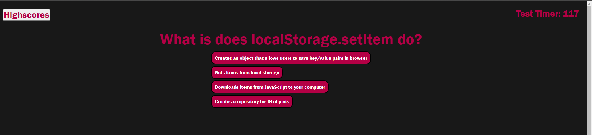
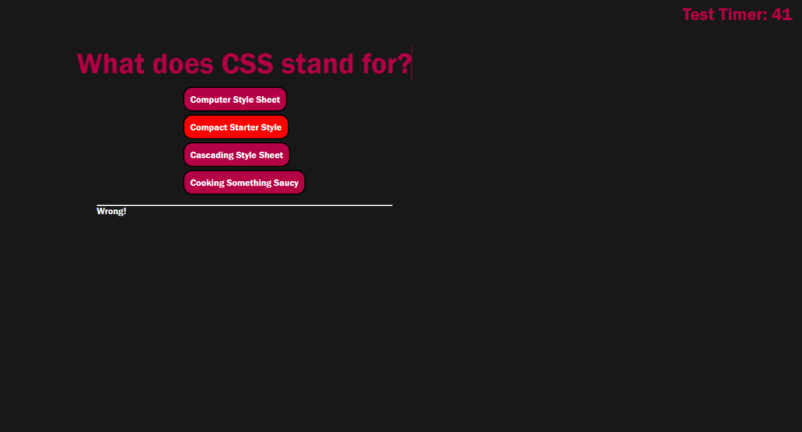
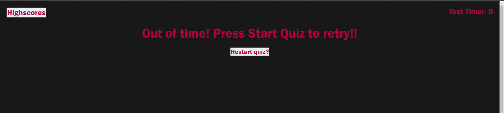
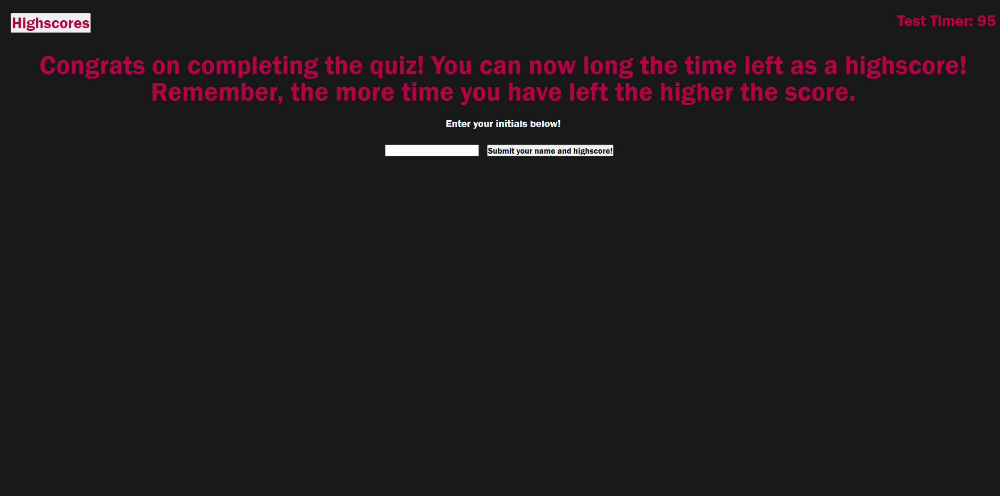

# JavaScript Quiz

## Description
This JavaScript Quiz features dynamic CSS styling and HTML modifications as users progress through the set of questions. The quiz responds to user selections by marking wrong answers in bright red and also subtracting time from the "quiz timer." Similarly this script modifies  elements to either display, hide, change colors and so on based upon user inputs. A user can save their highscore after completing the quiz. At the moment there is no feature to log multiple highscores, or to retry for a better highscore. 

However a feature uncalled for has been added that stops the quiz when the timer reaches 0 and allows a user to retry the quiz for a better highscore. The quiz questions can be updated, added to and modified as needed.

In addition to dynamic changes of styling this script will append new questions, new answer options and a right/wrong indicator.

While this script may prove useful for an individual user, it is also beneficial to the quiz writer as they can implement a multitude of questions with various answers and have those questions/answers be as long or prolific as needed.

This project was undoubtedly the most difficult yet as it fully blended JavaScript, CSS and basic HTML together. I found it difficult initially to create a function to append each question with their individual answers and to have those answers become dynamic based upon a users selection. Thankfully my tutor, Esterling Accime, was super helpful in directing me towards using for loops and setting up on click events for the answers.  

## Table of Contents
- [Installation] (#installation)
- [Live] (#live)
- [Usage/Examples] (#usage)
- [Credits] (#credits)
- [License] (#license)

## Live
- [https://skytexier.github.io/Javascript-Quiz/](https://skytexier.github.io/Javascript-Quiz/)

## Installation

For proper installation or usage of the website include index.html and assets folder. Script is found in assets folder.
No installation required unless modifying code, in such case proper git pulling from the repo and importing into editing software required.
    
## Usage/Examples

This page initially loads with little styling or elements on screen except for some basic instructions.

However upon clicking start quiz our script will add a new question and potential answers to the page.

If the user selects the wrong answer for the question, a status message appears alerting them. Time from the test timer will also be subtracted.

If a user selects too many wrong answers and runs out of time then the quiz will alert them with this page.

Upon completing the quiz, within the time frame, a user can then submit their name. This submission will take them to the highscores page (its all one page really) where they can see their highscore next to their

## Credits

Most of the help I recieved on this project came from Esterling Accime, the tutor I was assigned.

However I also used a myriad of resources to better understand things like setInterval, for loops, setAttribute and so on. 

Those resources are listed below:

- MDN [https://developer.mozilla.org/en-US/](https://developer.mozilla.org/en-US/)
- MDN Loops and Iterations [https://developer.mozilla.org/en-US/docs/Web/JavaScript/Guide/Loops_and_iteration](https://developer.mozilla.org/en-US/docs/Web/JavaScript/Guide/Loops_and_iteration)
- W3Schools Inputs etc. [https://www.w3schools.com/tags/tag_input.asp] (https://www.w3schools.com/tags/tag_input.asp)
- GeeksforGeeks [https://www.geeksforgeeks.org/how-to-create-a-simple-javascript-quiz/](https://www.geeksforgeeks.org/how-to-create-a-simple-javascript-quiz/)
                [https://www.geeksforgeeks.org/introduction-to-arrays/](https://www.geeksforgeeks.org/introduction-to-arrays/)
- Techie Delight [https://www.techiedelight.com/loop-through-array-of-objects-javascript/](https://www.techiedelight.com/loop-through-array-of-objects-javascript/)

## License
MIT License
 
Copyright (c) [2022] [Sky Hamilton Texier]
 
Permission is hereby granted, free of charge, to any person obtaining a copy
of this software and associated documentation files (the "Software"), to deal
in the Software without restriction, including without limitation the rights
to use, copy, modify, merge, publish, distribute, sublicense, and/or sell
copies of the Software, and to permit persons to whom the Software is
furnished to do so, subject to the following conditions:
 
The above copyright notice and this permission notice shall be included in all
copies or substantial portions of the Software.
 
THE SOFTWARE IS PROVIDED "AS IS", WITHOUT WARRANTY OF ANY KIND, EXPRESS OR
IMPLIED, INCLUDING BUT NOT LIMITED TO THE WARRANTIES OF MERCHANTABILITY,
FITNESS FOR A PARTICULAR PURPOSE AND NONINFRINGEMENT. IN NO EVENT SHALL THE
AUTHORS OR COPYRIGHT HOLDERS BE LIABLE FOR ANY CLAIM, DAMAGES OR OTHER
LIABILITY, WHETHER IN AN ACTION OF CONTRACT, TORT OR OTHERWISE, ARISING FROM,
OUT OF OR IN CONNECTION WITH THE SOFTWARE OR THE USE OR OTHER DEALINGS IN THE
SOFTWARE.